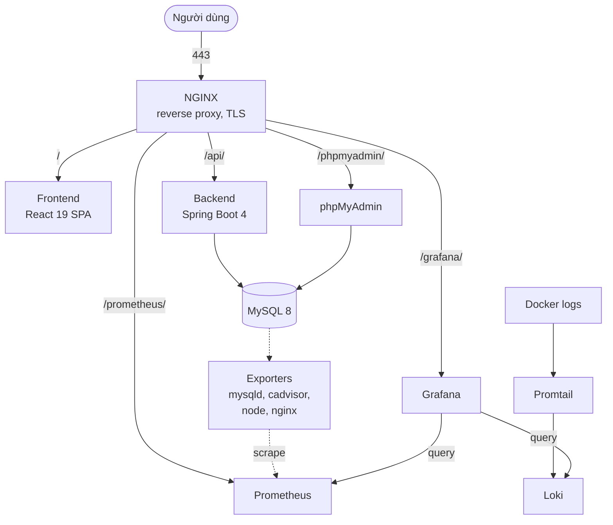

```mermaid
flowchart TD
    User([Người dùng]) -->|443| Nginx[NGINX<br/>reverse proxy, TLS]
    Nginx -->|/| FE[Frontend<br/>React 19 SPA]
    Nginx -->|/api/| BE[Backend<br/>Spring Boot 4]
    Nginx -->|/phpmyadmin/| PMA[phpMyAdmin]
    Nginx -->|/grafana/| GF[Grafana]
    Nginx -->|/prometheus/| PR[Prometheus]
    BE --> DB[(MySQL 8)]
    PMA --> DB
    Exp[Exporters<br/>mysqld, cadvisor,<br/>node, nginx] -.->|scrape| PR
    DB -.-> Exp
    Docker[Docker logs] --> Promtail --> Loki
    GF -->|query| Loki
    GF -->|query| PR
```
