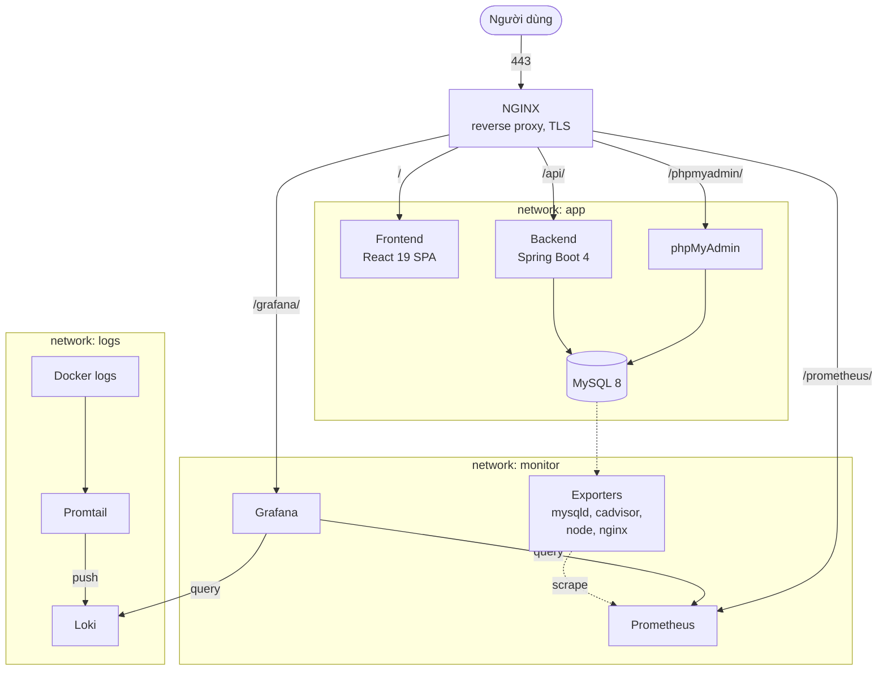

```mermaid
flowchart TD
    User([Người dùng]) -->|443| Nginx[NGINX<br/>reverse proxy, TLS]

    subgraph app [network: app]
        FE[Frontend<br/>React 19 SPA]
        BE[Backend<br/>Spring Boot 4]
        PMA[phpMyAdmin]
        DB[(MySQL 8)]
        BE --> DB
        PMA --> DB
    end

    subgraph monitor [network: monitor]
        PR[Prometheus]
        GF[Grafana]
        EXP[Exporters<br/>mysqld, cadvisor,<br/>node, nginx]
        EXP -.->|scrape| PR
        GF -->|query| PR
    end

    subgraph logs [network: logs]
        DL[Docker logs] --> PT[Promtail] -->|push| LK[Loki]
    end

    Nginx -->|/| FE
    Nginx -->|/api/| BE
    Nginx -->|/phpmyadmin/| PMA
    Nginx -->|/grafana/| GF
    Nginx -->|/prometheus/| PR
    GF -->|query| LK
    DB -.-> EXP
```
